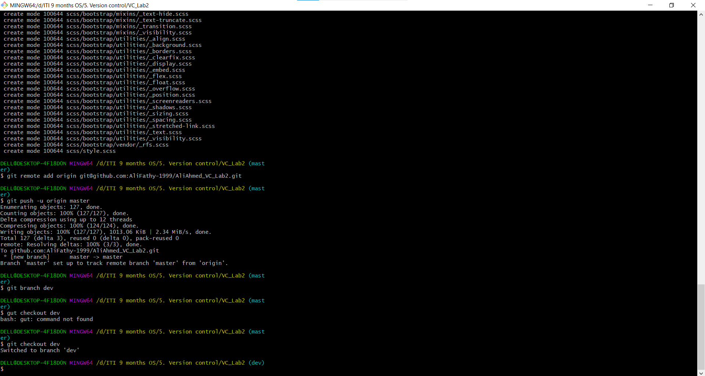
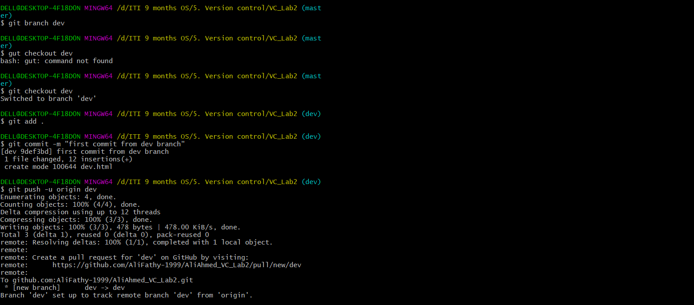
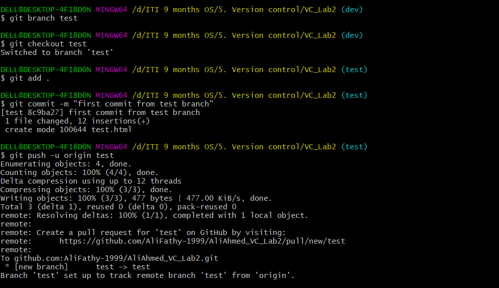

# Version Control Lab 2 README.md

<h1>lab2_1.png</h1>
  
  <h1>lab2_2.png</h1>
  
    <h1>lab2_3.png</h1>
  
      <h1>Merging</h1>
  
      <h1>delete div branch</h1>
  
        <h1>delete test branch</h1>
  
          <h1>tags</h1>
  
          <h1>List of tags</h1>
  
    <h1>Delete tags</h1>
  

